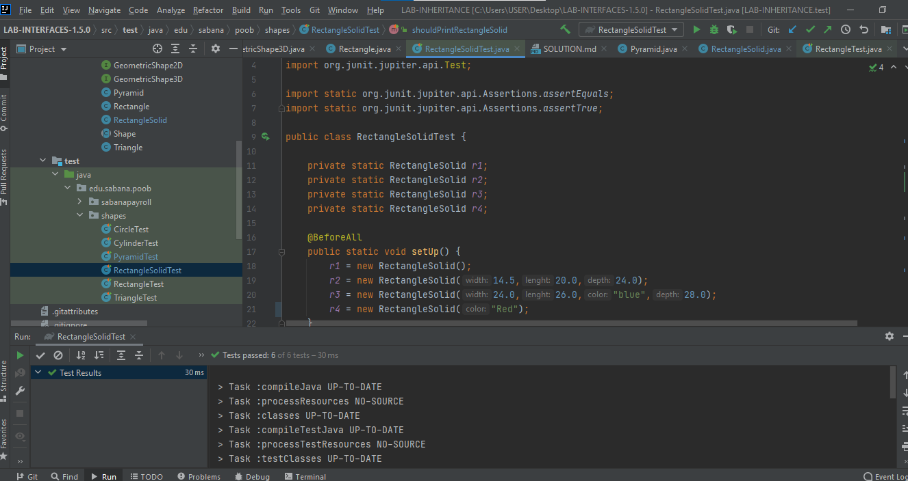

# PARTE 1
## ¿Cuál es la relación entre Circle y Shape?
Circle es la clase hija de shape, en su defecto la subclase de shape o circle hereda de shape, de igual forma circle hereda dos métodos: +():Shape  +():Circle  y +(Color):Shape  +(Color)

La relación que existe esta en el atributo color y tostring

## ¿Cuál es la relación entre Cylinder y Shape?
Es la subclase de Circle y de ahí la subclase de Shape, también se podría decir que Cylinder hereda de Circle y Circle hereda de Shape, de igual forma Cylinder hereda un método de shape: +():Shape  +():Cylinder

La relación que existe esta en el atributo color

## ¿Cuál es la relación entre Circle y GeometricShape2D?
Circle es una interfaz de GeometricShape2D

La relación que existe esta en el tostring comportamiento atributos del area y perímetro 
## ¿Cuál es la relación entre Cylinder y GeometricShape3D?
Cylinder es una interfaz de GeometricShape3D

## EVIDENCIAS DE LAS PRUEBAS

Evidencia de la prueba de CircleTest

Evidencia de la prueba de CylinderTest

# PARTE 2

## ImplementandoGeometricShape2D

Evidencias del TriangleTest

Evidencias del RectangleTest 

## Implementando GeometricShape3D

Evidencias del RectangleSolidTest

Evidencias del PyramidTest

##CUBE
Evidencias del CubeTest

