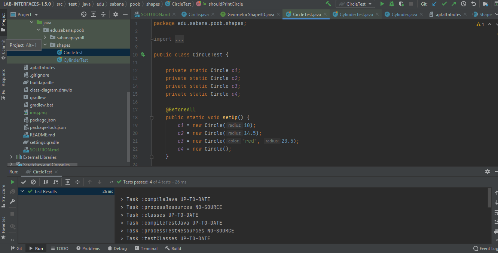
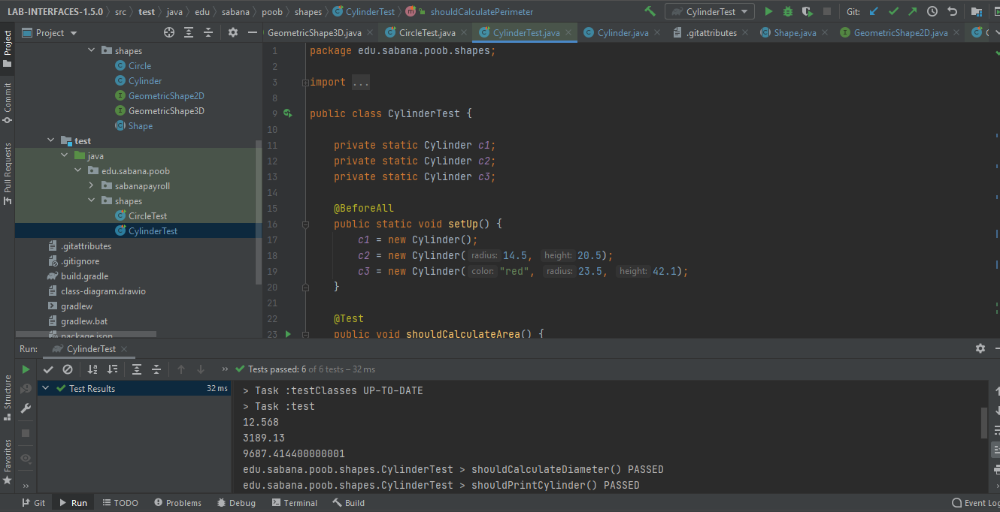
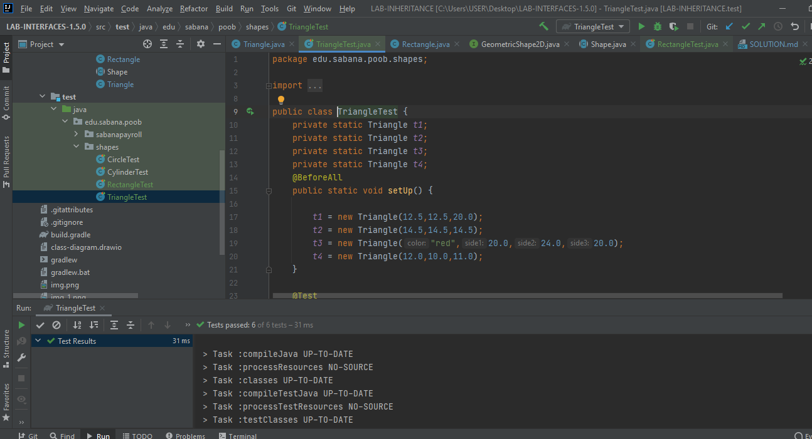
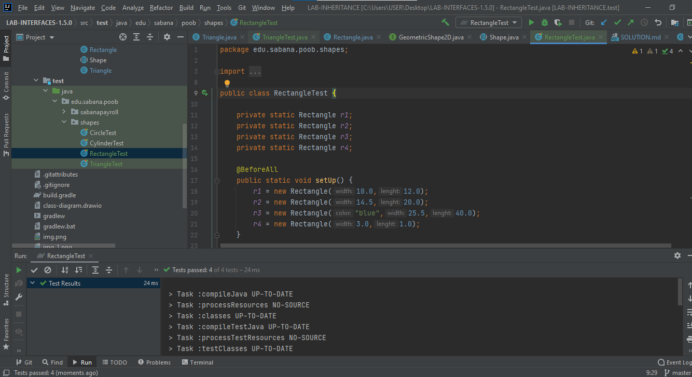
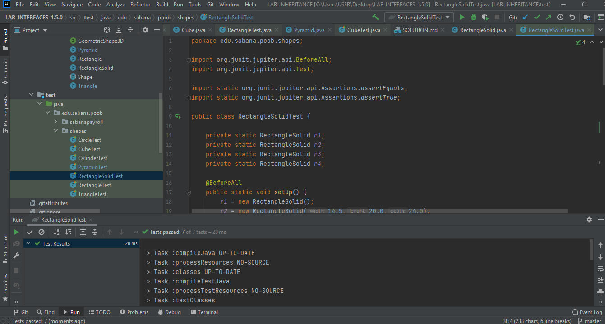
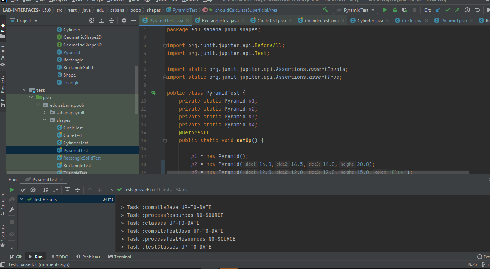
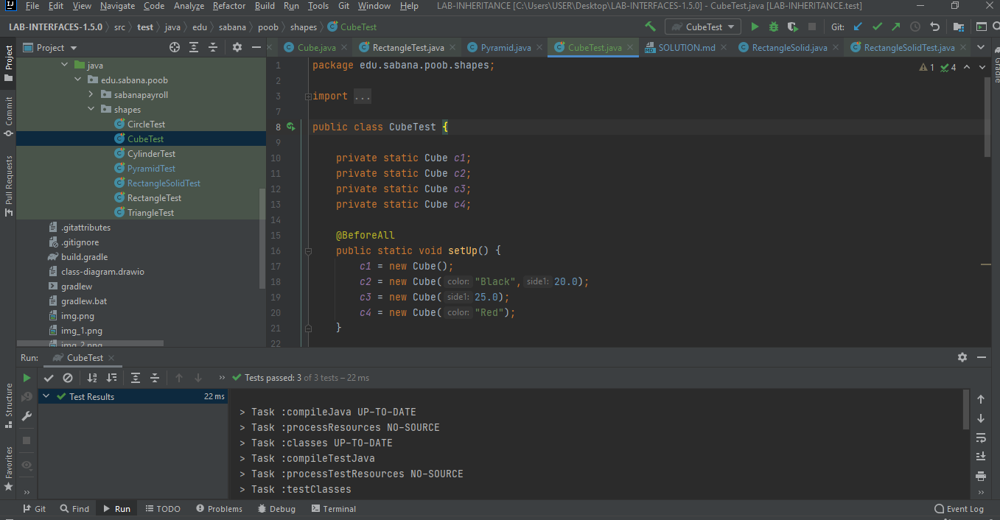
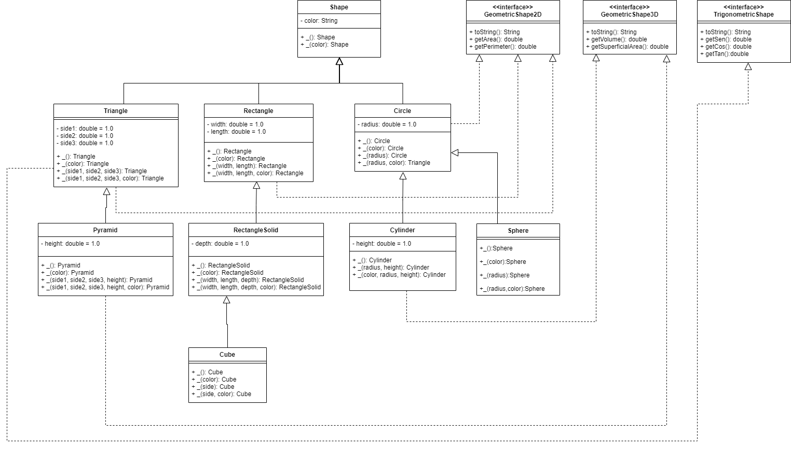

# PARTE 1
## ¿Cuál es la relación entre Circle y Shape? 

Circle es la clase hija de shape, por lo tanto circle hereda de shape, ya que el método que hereda es el del color.

## ¿Cuál es la relación entre Cylinder y Shape? 

Es la subclase de Circle y de ahí la subclase de Shape, también se podría decir que Cylinder hereda de Circle y Circle hereda de Shape, ya que el método que hereda es el del color y radio.

## ¿Cuál es la relación entre Circle y GeometricShape2D?

Circle es una interfaz de GeometricShape2D, con los atributos de Circle se pueden llevar acabo los métodos de encontrar área y perímetro en GeometricShape2D.

## ¿Cuál es la relación entre Cylinder y GeometricShape3D? 

Cylinder es una interfaz de GeometricShape3D, con los atributos de Cylinder se pueden llevar a cabo los métodos de encontrar volumen y área superficial de GeometricShape3D.

## EVIDENCIAS DE LAS PRUEBAS

Evidencia de la prueba de CircleTest

Evidencia de la prueba de CylinderTest

# PARTE 2

## ImplementandoGeometricShape2D

Evidencias del TriangleTest

Evidencias del RectangleTest 

## Implementando GeometricShape3D

Evidencias del RectangleSolidTest

Evidencias del PyramidTest

##CUBE
Evidencias del CubeTest

# PARTE 3

